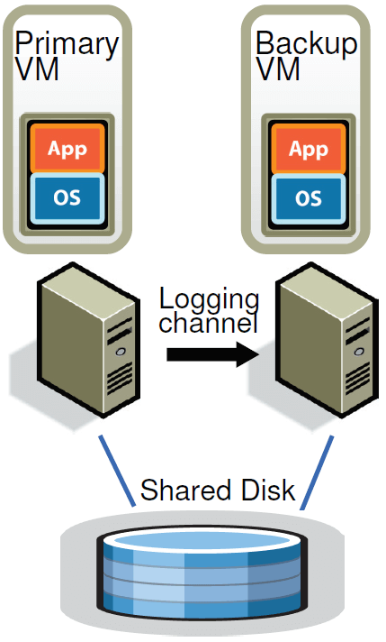
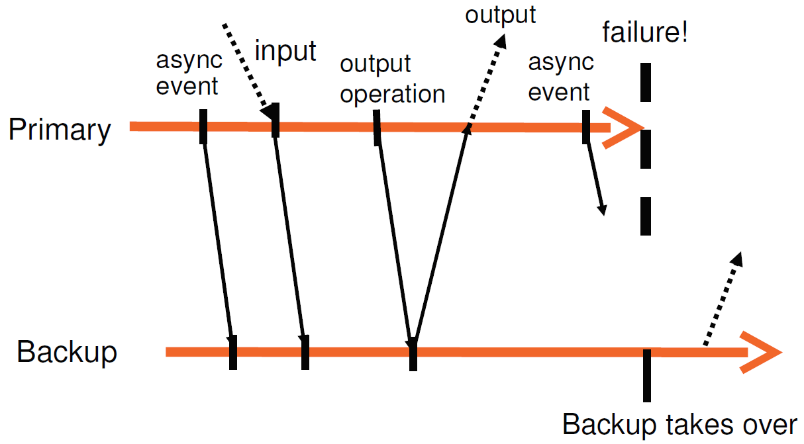
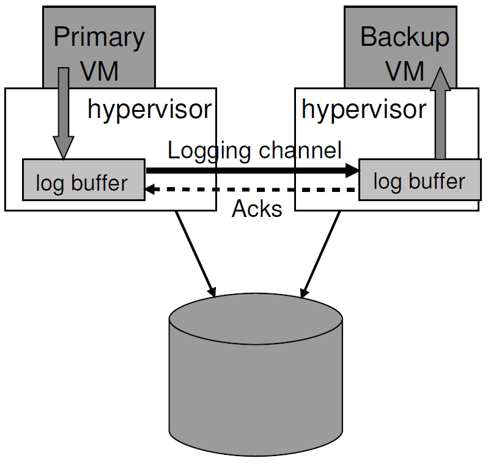
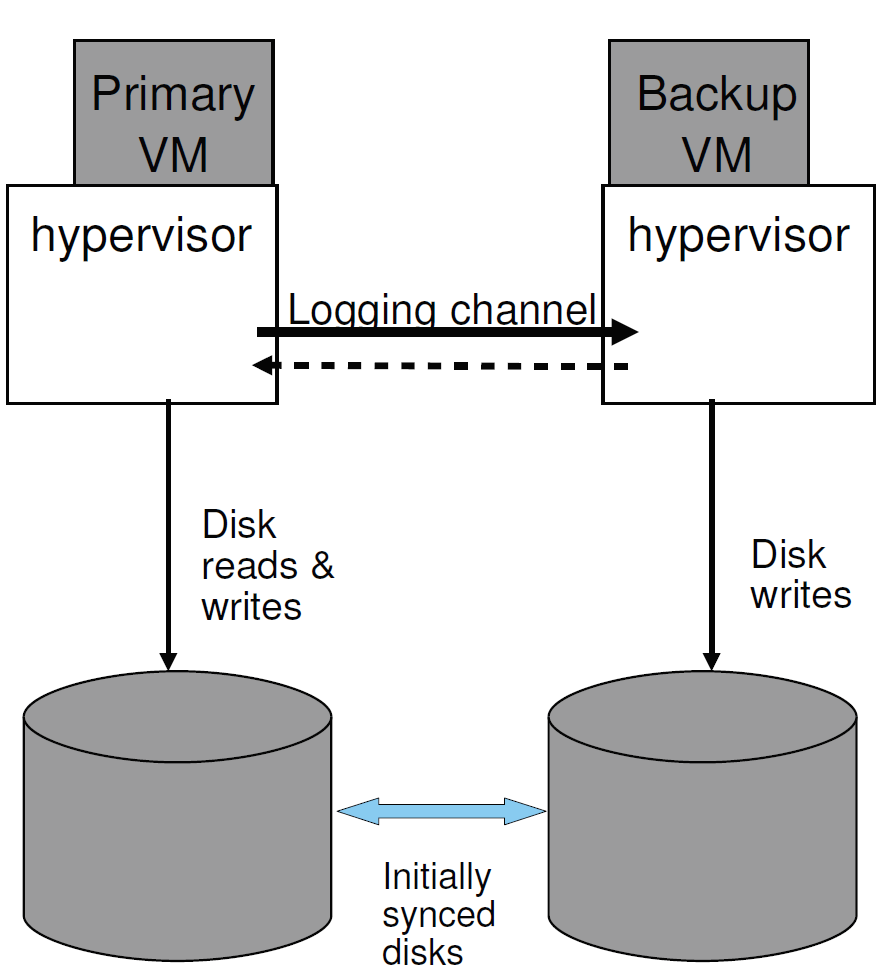

# 一个实用的容错虚拟机系统

## The Design of a Practical System for Fault-Tolerant Virtual Machines

---

Translate by [Jeff Zhao](mailto:zhaozhuo112@gmail.com)

[Original Paper](https://dl.acm.org/doi/10.1145/2882903.2903741)

---

Daniel J. Scales, Mike Nelson, and Ganesh Venkitachalam VMware, Inc {scales,mnelson,ganesh}@vmware.com

## 摘要

> We have implemented a commercial enterprise-grade system for providing fault-tolerant virtual machines, based on the approach of replicating the execution of a primary virtual machine (VM) via a backup virtual machine on another server. We have designed a complete system in VMware vSphere 4.0 that is easy to use, runs on commodity servers, and typically reduces performance of real applications by less than 10%. In addition, the data bandwidth needed to keep the primary and secondary VM executing in lockstep is less than 20 Mbit/s for several real applications, which allows for the possibility of implementing fault tolerance over longer distances. An easy-to-use, commercial system that automatically restores redundancy after failure requires many additional components beyond replicated VM execution. We have designed and implemented these extra components and addressed many practical issues encountered in supporting VMs running enterprise applications. In this paper, we describe our basic design, discuss alternate design choices and a number of the implementation details, and provide performance results for both micro-benchmarks and real applications.

我们实现了一个商业企业级系统，用于提供容错虚拟机，该系统基于通过另一台服务器上的备份虚拟机复制主虚拟机(VM)执行的方法。 我们在VMware vSphere
4.0中设计了一个完整的系统，该系统易于使用，运行在普通服务器上，通常实际应用程序的性能降低不到10%。 此外，对于几个实际应用程序，保持主VM和辅助VM同步执行所需的数据带宽小于20 Mbit/s，这允许在更长的距离上实现容错。
一个易于使用的商业系统，在失败后自动恢复冗余，除了复制VM执行外，还需要许多其他组件。 我们设计并实现了这些额外的组件，解决了在支持运行企业应用程序的vm时遇到的许多实际问题。
在本文中，我们描述了我们的基本设计，讨论了备选的设计选择和一些实现细节，并为微基准测试和实际应用程序提供了性能结果。

## 1 介绍

> A common approach to implementing fault-tolerant servers is the primary/backup approach [1], where a backup server is always available to take over if the primary server fails. The state of the backup server must be kept nearly identical to the primary server at all times, so that the backup server can take over immediately when the primary fails, and in such a way that the failure is hidden to external clients and no data is lost. One way of replicating the state on the backup server is to ship changes to all state of the primary, including CPU, memory, and I/O devices, to the backup nearly continuously. However, the bandwidth needed to send this state, particular changes in memory, can be very large.

实现容错服务器的一种常见方法是主/备份方法，在主服务器发生故障时，总是可以使用备份服务器进行接管。
备份服务器的状态必须始终保持与主服务器几乎相同，以便在主服务器发生故障时，备份服务器可以立即接管，并且以这种方式将故障隐藏在外部客户机中，不会丢失任何数据。 在备份服务器上复制状态的一种方法是几乎连续地将主服务器的所有状态(
包括CPU、内存和I/O设备)的更改发送到备份。 然而，发送此状态(内存中的特定更改)所需的带宽可能非常大。

> A different method for replicating servers that can use much less bandwidth is sometimes referred to as the statemachine approach [13]. The idea is to model the servers as deterministic state machines that are kept in sync by starting them from the same initial state and ensuring that they receive the same input requests in the same order. Since most servers or services have some operations that are not deterministic, extra coordination must be used to ensure that a primary and backup are kept in sync. However, the amount of extra information need to keep the primary and backup in sync is far less than the amount of state (mainly memory updates) that is changing in the primary.

另一种可以使用更少带宽的复制服务器的方法有时被称为statemachine方法。 其思想是将服务器建模为确定性状态机，这些状态机从相同的初始状态启动，并确保它们以相同的顺序接收相同的输入请求，从而保持同步。
由于大多数服务器或服务具有一些不确定的操作，因此必须使用额外的协调来确保主服务器和备份保持同步。 但是，保持主服务器和备份同步所需的额外信息量远远小于主服务器中正在更改的状态量(主要是内存更新)。

> Implementing coordination to ensure deterministic execution of physical servers [14] is difficult, particularly as processor frequencies increase. In contrast, a virtual machine (VM) running on top of a hypervisor is an excellent platform for implementing the state-machine approach. A VM can be considered a well-defined state machine whose operations are the operations of the machine being virtualized (including all its devices). As with physical servers, VMs have some non-deterministic operations (e.g. reading a time-of-day clock or delivery of an interrupt), and so extra information must be sent to the backup to ensure that it is kept in sync. Since the hypervisor has full control over the execution of a VM, including delivery of all inputs, the hypervisor is able to capture all the necessary information about non-deterministic operations on the primary VM and to replay these operations correctly on the backup VM.

实现协调以确保物理服务器的确定性执行是困难的，特别是在处理器频率增加的情况下。 相反，运行在管理程序之上的虚拟机(VM)是实现状态机方法的优秀平台。 VM可以被认为是定义良好的状态机，其操作是被虚拟化的机器的操作(包括它的所有设备)。
与物理服务器一样，vm也有一些不确定的操作(例如读取一个时钟时间或发送一个中断)，因此必须将额外的信息发送到备份，以确保其保持同步。
由于系统管理程序完全控制VM的执行，包括所有输入的交付，所以系统管理程序能够捕获主VM上关于不确定性操作的所有必要信息，并在备份VM上正确地重播这些操作。

> Hence, the state-machine approach can be implemented for virtual machines on commodity hardware, with no hardware modifications, allowing fault tolerance to be implemented immediately for the newest microprocessors. In addition, the low bandwidth required for the state-machine approach allows for the possibility of greater physical separation of the primary and the backup. For example, replicated virtual machines can be run on physical machines distributed across a campus, which provides more reliability than VMs running in the same building.

因此，状态机方法可以在普通硬件上为虚拟机实现，而不需要修改硬件，允许对最新的微处理器立即实现容错。 此外，状态机方法所需的低带宽允许对主服务器和备份进行更大的物理分离。
例如，复制的虚拟机可以在跨校园分布的物理机器上运行，这比在同一建筑物中运行的vm提供了更高的可靠性。

> We have implemented fault-tolerant VMs using the primary/ backup approach on the VMware vSphere 4.0 platform, which runs fully virtualized x86 virtual machines in a highly-efficient manner. Since VMware vSphere implements a complete x86 virtual machine, we are automatically able to provide fault tolerance for any x86 operating systems and applications. The base technology that allows us to record the execution of a primary and ensure that the backup executes identically is known as deterministic replay [15]. VMware vSphere Fault Tolerance (FT) is based on deterministic replay, but adds in the necessary extra protocols and functionality to build a complete fault-tolerant system. In addition to providing hardware fault tolerance, our system automatically restores redundancy after a failure by starting a new backup virtual machine on any available server in the local cluster. At this time, the production versions of both deterministic replay and VMware FT support only uni-processor VMs. Recording and replaying the execution of a multi-processor VM is still work in progress, with significant performance issues because nearly every access to shared memory can be a non-deterministic operation.

我们在VMware vSphere 4.0平台上使用主/备份的方式实现了容错vm，该平台能够高效运行完全虚拟化的x86虚拟机。 因为VMware
vSphere实现了一个完整的x86虚拟机，所以我们可以自动为任何x86操作系统和应用程序提供容错能力。 允许我们记录主服务器的执行并确保备份以相同方式执行的基本技术称为确定性重放。 VMware vSphere容错(FT)
是基于确定性重放的，但是增加了必要的额外协议和功能来构建一个完整的容错系统。 除了提供硬件容错之外，我们的系统还通过在本地集群中任何可用的服务器上启动一个新的备份虚拟机，在出现故障后自动恢复冗余。 此时，确定性回放和VMware
FT的生产版本都只支持单处理器vm。 记录和回放多处理器VM的执行仍然在进行中，存在严重的性能问题，因为对共享内存的几乎每次访问都可能是不确定的操作。

图1 基础FT配置

> Bressoud [3] describes a prototype implementation of fault-tolerant VMs for the HP PARISC platform. Our approach is similar, but we have made some fundamental changes for performance reasons and investigated a number of design alternatives. In addition, we have had to design and implement many additional components in the system and deal with a number of practical issues to build a complete system that is efficient and usable by customers running enterprise applications. Similar to most other practical systems discussed, we only attempt to deal with fail-stop failures [12], which are server failures that can be detected before the failing server causes an incorrect externally visible action.

Bressoud描述了对于HP PARISC平台的容错虚拟机的原型实现。我们的方法是类似的，但是由于性能的原因，我们做了一些基本的改变，并研究了一些设计方案。
此外，我们必须在系统中设计和实现许多额外的组件，并处理许多实际问题，以构建一个完整的系统，该系统对于运行企业应用程序的客户来说是高效和可用的。
与讨论的大多数其他实际系统类似，我们只尝试处理故障停止故障，即在故障服务器导致错误的外部可见操作之前可以检测到的服务器故障。

> The rest of the paper is organized as follows. First, we describe our basic design and detail our fundamental protocols that ensure that no data is lost if a backup VM takes over after a primary VM fails. Then, we describe in detail many of the practical issues that must be addressed to build a correct, robust, fully-functioning, and automated system. We also describe several design choices that arise for implementing fault-tolerant VMs and discuss the tradeoffs in these choices. Next, we give performance results for our implementation for some benchmarks and some real enterprise applications. Finally, we describe related work and conclude.

这篇论文的其余部分安排如下。首先，我们描述了我们的基础设计并详细介绍我们的基础协议，基础协议确保主机故障后由备机接管的时候没有数据丢失。然后，我们详细描述为建立一个正确的，健壮的，完整功能的，自动的系统必然会遇到的问题。我们还会描述一些为实现容错虚拟机会遇到的一些设计选择，讨论对这些选择的权衡。接着，我们提供我们的实现在一些benchmarks和一些实际企业应用上的性能表现。最后，我们会介绍相关的工作和结论。

## 2 FT的基本设计

> Figure 1 shows the basic setup of our system for fault-tolerant VMs. For a given VM for which we desire to provide fault tolerance (the primary VM), we run a backup VM on a different physical server that is kept in sync and executes identically to the primary virtual machine, though with a small time lag. We say that the two VMs are in virtual lockstep. The virtual disks for the VMs are on shared storage (such a Fibre Channel or iSCSI disk array), and therefore accessible to the primary and backup VM for input and output. (We will discuss a design in which the primary and backup VM have separate non-shared virtual disks in Section 4.1.) Only the primary VM advertises its presence on the network, so all network inputs come to the primary VM. Similarly, all other inputs (such as keyboard and mouse) go only to the primary VM.

图1显示了我们的系统的基本设置。 对于我们希望为其提供容错的给定VM(主VM)，我们在不同的物理服务器上运行备份VM，该服务器保持同步并与主虚拟机执行相同，只是有一点时间延迟。 我们说这两个vm是同步的。 VM的虚拟磁盘位于共享存储上(
例如Fibre Channel或iSCSI磁盘阵列)，因此主VM和备份VM可以访问它们的输入和输出。 (我们将在第4.1节中讨论主VM和备份VM具有独立的非共享虚拟磁盘的设计。)
只有主VM通知它在网络上的存在，因此所有网络输入都进入主VM。 类似地，所有其他输入(如键盘和鼠标)都只进入主VM。

> All input that the primary VM receives is transmitted to the backup VM via a network connection known as the logging channel. For server workloads, the dominant input traffic is network and disk. Additional information, as discussed below in Section 2.1, is transmitted as necessary to ensure that the backup VM executed non-deterministic operations in the same way as the primary VM. The end result is that the backup VM always executes identically to the primary VM. However, the outputs of the backup VM are always dropped by the hypervisor, so only the primary produces actual outputs that are returned to clients. As described in Section 2.2, the primary and backup VM must follow a specific protocol, including explicit acknowledgments by the backup VM, in order to ensure that no data is lost if the primary fails.

主VM接收的所有输入都通过一个称为日志通道的网络连接发送到备份VM。 对于服务器工作负载，主要的输入流量是网络和磁盘。 为了确保备份VM以与主VM相同的方式执行非确定性操作，需要传输额外的信息(如下面的2.1节所述)。
结果是备份VM总是与主VM执行相同。 但是，备份VM的输出会被系统管理程序删除，因此只有主VM产生返回给客户机的实际输出。 如第2.2节所述，主VM和备份VM遵循特定的协议，包括备份VM的显式确认，以确保在主VM失败时不会丢失任何数据。

> A crucial issue that is not discussed much in previous work is the actual process of determining quickly whether a primary or backup VM has failed. Our system uses a combination of heartbeating between the relevant servers and monitoring of the traffic on the logging channel. In addition, we must ensure that only one of the primary or backup VM takes over execution, even if there is a split-brain situation where the primary and backup servers have lost communication with each other.

在之前的工作中没有过多讨论的一个关键问题是快速确定主虚拟机或备份虚拟机是否发生故障的实际过程。 我们的系统结合使用相关服务器之间的心跳和日志通道上的流量监控。
此外，我们必须确保只有主虚拟机或备份虚拟机中的一个接管执行，即使存在主备服务器失去通信的裂脑情况。

> In the following sections, we provide more details on several important areas. In Section 2.1, we give some details on the deterministic replay technology that ensures that primary and backup VMs are kept in sync via the information sent over the logging channel. In Section 2.2, we describe a fundamental rule of our FT protocol that ensures that no data is lost if the primary fails. In Section 2.3, we describe our methods for detecting and responding to a failure in a correct fashion.

在下面的小节中，我们将提供几个重要领域的更多细节。 在第2.1节中，我们详细介绍了确定性重放技术，它确保主vm和备份vm通过日志通道发送的信息保持同步。
在第2.2节中，我们描述了我们的FT协议的一个基本规则，它确保在主节点失败时不会丢失数据。 在第2.3节中，我们描述了以正确的方式检测和响应故障的方法。

### 2.1 确定性重放的实现

> As we have mentioned, replicating servers (or VMs) can be modeled as the replication of deterministic state machines. If two deterministic state machines are started in the same initial state and provided the exact same inputs in the same order, then they will go through the same sequences of states and produce the same outputs. In the simplest case, one state machine is the primary, and the other is the backup. If all the inputs go to the primary, then the inputs can be distributed to the backup from the primary via a logging channel. A useful physical computer, when considered as a state machine, has a broad set of inputs ranging from a keyboard device to network input received from a client. In addition, nondeterministic events like virtual interrupts, and non-deterministic operations like reading the clock cycle counter from the processor, affect the state machine. This presents three challenges to a practical hypervisor capable of running any operating system that can run on a physical machine: (1) correctly capturing all the input and non-determinism necessary to ensure deterministic execution of a backup virtual machine, (2) correctly applying the inputs and non-determinism to the backup virtual machine, and (3) doing so in a manner that doesn’t degrade performance.

如前所述，备份服务器(或备份虚拟机)
可以被建模为确定性状态机的备份。如果两个确定性状态机以相同的初始状态启动并提供相同次序的完全相同的输入，则它们将经过相同的状态顺序并产生相同的输出。在最简单的情况，一个状态机是主，另一个是备。如果所有的输入都到达主，则输出可通过日志通道从主分发给备机。一个有用的物理计算机，作为状态机的时候，有广泛的输入范围，从键盘设备到来自客户端的网络输入。另外，不确定的事件比如虚拟中断，和不确定性操作像是从处理器读取时钟周期计数器，会影响状态机。这给实际的虚拟机管理程序在物理机上运行任何操作系统的能力带来了3个挑战：
(1) 正确的捕获所有输入和必要的不确定性来保证备机的确定性执行
(2) 正确的应用输入和不确定性给备机
(3) 以不降低性能的方式进行

> VMware deterministic replay [15] provides exactly this functionality for x86 virtual machines on the VMware vSphere platform. Deterministic replay allows the inputs of a VM and all possible non-determinism associated with the VM execution to be recorded via a stream of log entries written to a log file. The VM execution may be replayed later exactly by reading the log entries from the file. Non-deterministic state transitions can either result from explicit operations executed by the VM that have non-deterministic results (such as reading the time-of-day clock), or asynchronous events (such as interrupts) which create non-determinism because the point at which they interrupt the dynamic instruction stream affects the virtual machine execution.

Vmware确定性重放正是为VMware
vSphere平台上的x86虚拟机提供了此功能。确定性重放允许虚拟的输入和所有与虚拟机执行相关联的可能的不确定性能够通过写到日志文件的日志项的流记录下来。通过读取日志文件的日志项，可以在稍后准确的回访虚拟机的执行。不确定性状态转换可能是由有不确定性结果(
比如读取time-of-day的时钟)的虚拟机的显式操作导致，也可能由异步的事件(比如中断)导致。这两种会导致不确定状态是因为它们打断动态指令流的时候会影响虚拟机的执行。

> For non-deterministic operations, sufficient information must be logged to allow the operation to be reproduced with the same state change and output when replaying. For nondeterministic events such as timer interrupts or IO completion interrupts, the exact instruction at which the event occurred must also be recorded. During replay, the event must be delivered at the exact same point in the instruction stream. VMware deterministic replay implements an efficient event recording and event delivery mechanism that employs various techniques, including the use of hardware performance counters developed in conjunction with AMD [2] and Intel [8].

对于不确定性操作，充足的信息必须被日记记录下来，来让重放的时候操作可以按照相同的状态改变和输出被重置。对于不确定性的事件比如时钟中断或者IO完成中断，还必须记录事件发生的确切指令。在重放期间，必须在指令流的同一时间点传递事件。VMware确定性重放实现了一个有效的事件记录和事件传递机制，该机制使用了多种技术，包括由amd和intel联合开发的硬件性能计数器。

> Bressoud [3] mentions dividing the execution of VM into epochs, where non-deterministic events such as interrupts are only delivered at the end of an epoch. The notion of epoch seems to be used as a batching mechanism because it is too expensive to deliver each interrupt separately at the exact instruction where it occurred. However, our event delivery mechanism is efficient enough that VMware deterministic replay has no need to use epochs. The occurrence of each interrupt is recorded and logged as it occurs and efficiently delivered at the appropriate instruction while being replayed.

Bressoud提到了将虚拟机的执行分为周期，不确定性事件比如中断只在最后的周期传递。周期被用于批处理机制，因为在中断发生的时候分别传递每一个中断在对应的指令是代价很高的。然而，我们的事件传递机制是足够有效的，所以VMware确定性重放不需要使用周期.每一个中断的发生都可以被记录并写到日志，并有效的传递给适当的指令，在重放的时候。

### 2.2 FT协议

> For VMware FT, we use deterministic replay to produce the necessary log entries to record the execution of the primary VM, but instead of writing the log entries to disk, we send them to the backup VM via the logging channel. The backup VM replays the entries in real time, and hence executes identically to the primary VM. However, we must augment the logging entries with a strict FT protocol on the logging channel in order to ensure that we achieve fault tolerance. Our fundamental requirement is the following:

对于VMware FT，我们使用确定性重放来生成必要的日志条目来记录主VM的执行，但是我们不将日志条目写入磁盘，而是通过日志通道将它们发送到备份VM。 备份VM实时回放这些条目，因此与主VM执行相同。
但是，我们必须在日志通道上使用严格的FT协议来增加日志条目，以确保实现容错。 我们的基本要求是:

> Output Requirement: if the backup VM ever takes over after a failure of the primary, the backup VM will continue executing in a way that is entirely consistent with all outputs that the primary VM has sent to the external world.

输出要求:如果备份VM曾经

> Note that after a failover occurs (i.e. the backup VM takes over after the failure of the primary VM), the backup VM will likely start executing quite differently from the way the primary VM would have continued executing, because of the many non-deterministic events happening during execution. However, as long as the backup VM satisfies the Output Requirement, no state or data is lost during a failover to the backup VM, and the clients will notice no interruption or inconsistency in their service.

主虚拟机发生故障后，备份虚拟机将继续以与主虚拟机发送到外部世界的所有输出完全一致的方式执行。 请注意，在发生故障转移之后(即，备份VM在主VM发生故障后接管)
，备份VM的启动方式可能与主VM继续执行的方式非常不同，因为在执行期间会发生许多不确定的事件。 但是，只要备份VM满足输出要求，在故障转移到备份VM期间就不会丢失外部可见的状态或数据，客户机也不会注意到它们的服务中没有中断或不一致。

> The Output Requirement can be ensured by delaying any external output (typically a network packet) until the backup VM has received all information that will allow it to replay execution at least to the point of that output operation. One necessary condition is that the backup VM must have received all log entries generated prior to the output operation. These log entries will allow it to execute up to the point of the last log entry. However, suppose a failure were to happen immediately after the primary executed the output operation. The backup VM must know that it must keep replaying up to the point of the output operation and only “go live” (stop replaying and take over as the primary VM, as described in Section 2.3) at that point. If the backup were to go live at the point of the last log entry before the output operation, some non-deterministic event (e.g. timer interrupt delivered to the VM) might change its execution path before it executed the output operation.

输出需求可以通过延迟任何外部输出(通常是一个网络包)来确保，直到备份VM已经接收到所有信息，这些信息将允许它至少重播执行到输出操作的那一点。 一个必要的条件是，备份VM必须接收到输出操作之前生成的所有日志条目。
这些日志条目将允许它执行到最后一个日志条目。 但是，假设在主服务器执行输出操作之后立即发生故障。 备份VM必须知道，它必须一直重播到输出操作的那一点，并且在那一点上只“运行”(停止重播并接管主VM，如2.3节所述)。
如果备份在输出操作之前的最后一个日志条目上运行，一些不确定的事件(例如，发送到VM的计时器中断)可能会在执行输出操作之前更改其执行路径。

> Given the above constraints, the easiest way to enforce the Output Requirement is to create a special log entry at each output operation. Then, the Output Requirement may be enforced by this specific rule:

根据上面的约束，实现输出需求的最简单方法是创建一个特殊的日志条目输出操作。然后，输出需求可以通过这个特定的规则来执行:

> Output Rule: the primary VM may not send an output to the external world, until the backup VM has received and acknowledged the log entry associated with the operation producing the output.

输出规则:主VM可能不会向外部世界发送输出，直到备份VM接收并确认与产生输出的操作相关的日志条目。

> If the backup VM has received all the log entries, including the log entry for the outputproducing operation, then the backup VM will be able to exactly reproduce the state of the primary VM at that output point, and so if the primary dies, the backup will correctly reach a state that is consistent with that output. Conversely, if the backup VM takes over without receiving all necessary log entries, then its state may quickly diverge such that it is inconsistent with the primary’s output. The Output Rule is in some ways analogous to the approach described in [11], where an “externally synchronous” IO can actually be buffered, as long as it is actually written to disk before the next external communication.

如果备份虚拟机已经收到了所有的日志条目,包括output-producing操作的日志条目,然后备份虚拟机将能够完全复制主虚拟机的状态输出点,所以如果主死了,备份将正确地看到一个状态,输出一致。
相反，如果备份VM在没有接收所有必需的日志条目的情况下接管，那么它的状态可能会很快偏离，从而与主服务器的输出不一致。
输出规则在某些方面类似于中描述的方法，在这种方法中，“外部同步”IO实际上可以被缓冲，只要它在下一次外部通信之前被实际写入磁盘。

> Note that the Output Rule does not say anything about stopping the execution of the primary VM. We need only delay the sending of the output, but the VM itself can continue execution. Since operating systems do non-blocking network and disk outputs with asynchronous interrupts to indicate completion, the VM can easily continue execution and will not necessarily be immediately affected by the delay in the output. In contrast, previous work [3, 9] has typically indicated that the primary VM must be completely stopped prior to doing an output until the backup VM has acknowledged all necessary information from the primary VM.

注意，输出规则并没有说任何关于停止主VM执行的内容。 我们只需要延迟输出的发送，但是VM本身可以继续执行。 由于操作系统执行非阻塞网络和磁盘输出，并使用异步中断来指示完成，所以VM可以很容易地继续执行，而且不一定会立即受到输出延迟的影响。
相反，以前的工作[3,9]通常表明，在执行输出之前，主VM必须完全停止，直到备份VM从主VM确认了所有必要的信息。

图1 FT协议

> As an example, we show a chart illustrating the requirements of the FT protocol in Figure 2. This figure shows a timeline of events on the primary and backup VMs. The arrows going from the primary line to the backup line represent the transfer of log entries, and the arrows going from the backup line to the primary line represent acknowledgments. Information on asynchronous events, inputs, and output operations must be sent to the backup as log entries and acknowledged. As illustrated in the figure, an output to the external world is delayed until the primary VM has received an acknowledgment from the backup VM that it has received the log entry associated with an output operation. Given that the Output Rule is followed, the backup VM will be able to take over in a state consistent with the primary’s last output. There will be no loss of state even if the primary has had a non-deterministic event since its last output.

例如，我们在图2中展示了说明FT协议要求的图表。该图显示了主vm和备份vm上的事件时间轴。从主行到备份行的箭头表示日志条目的转移，从备份行到主行的箭头表示确认。 有关异步事件、输入和输出操作的信息必须作为日志项发送到备份并得到确认。
如图所示，外部世界的输出被延迟，直到主VM从备份VM接收到与输出操作相关的日志条目的确认。 如果遵循了输出规则，那么备份VM将能够以与主服务器的最后输出一致的状态接管。

我们不能保证在故障转移情况下，所有输出都只生成一次。 在主服务器打算发送输出时，如果不使用具有两阶段提交的事务，备份就无法确定主服务器在发送最后一个输出之前或之后立即崩溃。 幸运的是，网络基础设施(包括TCP的常见使用)
被设计用来处理丢失的包和相同的(重复的)包。 请注意，到主服务器的传入包也可能在主服务器故障期间丢失，因此不会传递到备份服务器。
然而，传入的数据包可能由于与服务器故障无关的任何原因被丢弃，所以网络基础设施、操作系统和应用程序都被编写来确保它们能够补偿丢失的数据包。

### 2.3 检测和响应故障

如上所述，如果其他VM出现故障，主VM和备份VM必须快速响应。 如果备份VM失败，主VM将启动—也就是说，保留记录模式(因此停止在日志通道上发送条目)，并开始正常执行。 如果主VM失败，备份VM也应该启动，但是过程要复杂一点。
由于执行的延迟，备份VM可能会有许多它已经接收和确认的日志条目，但是还没有被使用，因为备份VM的执行还没有达到适当的点。 备份VM必须继续从日志条目中重播它的执行，直到它消耗完最后一个日志条目。
此时，备份VM将停止重播模式，并开始作为普通VM执行。 实际上，备份VM已经升级到主VM(现在缺少一个备份VM)。 由于它不再是一个备份VM，新的主VM现在将在来宾操作系统执行输出操作时向外部世界生成输出。
在转换到正常模式期间，可能需要一些特定于设备的操作来允许正确地执行此输出。 特别是，为了联网，VMware FT会自动通知网络上新主VM的MAC地址，这样物理网络交换机就知道新主VM位于哪个服务器上。
此外，新升级的主VM可能需要重新发行一些磁盘IOs(如3.4节所述)。

有许多可能的方法可以尝试检测主vm和备份vm的故障。 VMware FT在运行容错vm的服务器之间使用UDP心跳来检测服务器何时可能崩溃。 另外，VMware FT监视从主VM发送到备份VM的日志流量，以及从备份VM发送到主VM的确认。
由于定期的计时器中断，日志记录流量应该是定期的，并且对于功能正常的来宾操作系统永远不应该停止。 因此，日志条目或确认流中的停顿可能表示VM失败。 如果心跳或日志流量停止的时间超过了特定的超时时间(大约几秒)，就会声明失败。

然而，任何这样的故障检测方法都容易受到裂脑问题的影响。 如果备份服务器停止接收来自主服务器的心跳，这可能表明主服务器已经失败，或者可能只是意味着仍然在运行的服务器之间的所有网络连接已经丢失。
如果备份VM在主VM实际仍在运行时启动，则可能会出现数据损坏和与VM通信的客户端出现问题。 因此，我们必须确保在检测到故障时主VM或备份VM中只有一个是活动的。 为了避免裂脑问题，我们使用了存储VM虚拟磁盘的共享存储。
当主VM或备份VM希望启用时，它将在共享存储上执行一个原子测试集操作。 如果操作成功，则允许VM运行。 如果操作失败，那么另一个VM肯定已经启动了，所以当前VM实际上会停止自己(“自杀”)。
如果VM在尝试执行原子操作时无法访问共享存储，那么它将一直等待，直到可以访问为止。 注意，如果共享存储由于存储网络中的某些故障而无法访问，那么VM可能无法进行有用的工作，因为虚拟磁盘驻留在相同的共享存储上。
因此，使用共享存储来解决分裂大脑的情况不会引入任何额外的不可用性。

该设计的最后一个方面是，一旦发生故障，其中一个VM已经上线，VMware FT会在另一台主机上启动一个新的备份VM，从而自动恢复冗余。 虽然这个过程在以前的大多数工作中没有涉及，但是它是使容错vm有用的基础，并且需要仔细的设计。
更多细节见3.1节。

## 3 FT的实际应用

第2节描述了FT的基本设计和协议。然而，要创建一个可用的、健壮的、自动化的系统，还必须设计和实现许多其他组件。

### 3.1 启动和重新启动FT vm

必须设计的最大的附加组件之一是启动与主VM处于相同状态的备份VM的机制。 当发生故障后重新启动备份VM时，也将使用此机制。 因此，对于处于任意状态(即不只是启动)的正在运行的主VM，此机制必须是可用的。
此外，我们希望该机制不会显著地中断主VM的执行，因为这将影响VM的任何当前客户机。

对于VMware FT，我们采用了VMware vSphere现有的VMotion功能。 VMware VMotion允许将一个运行中的VM从一个服务器迁移到另一个服务器，而对其造成的干扰最小——VM暂停时间通常小于一秒。
我们创建了一个修改过的VMotion表单，它在远程服务器上创建了一个VM的精确运行副本，但不会破坏本地服务器上的VM。 也就是说，我们修改后的FT VMotion将VM克隆到远程主机，而不是迁移它。 FT
VMotion还设置了一个日志通道，并导致源VM进入日志记录模式作为主要的，而目标VM进入回放模式作为新的备份。 与普通的VMotion一样，FT VMotion通常会在不到一秒的时间内中断主VM的执行。
因此，在运行的VM上启用FT是一种简单、无干扰的操作。

启动备份VM的另一个方面是选择运行它的服务器。 容错vm运行在能够访问共享存储的服务器集群中，因此所有vm通常可以运行在集群中的任何服务器上。 这种灵活性使得VMware vSphere甚至可以恢复FT冗余

一个或多个服务器发生故障。 VMware vSphere实现了一个集群服务，用于维护管理和资源信息。 当发生故障时，主VM现在需要一个新的备份VM来重新建立冗余，主VM会通知集群服务它需要一个新的备份。
集群服务根据资源使用情况和其他约束来确定运行备份VM的最佳服务器，并调用FT VMotion来创建新的备份VM。 其结果是，VMware FT通常可以在服务器发生故障后几分钟内重新建立VM冗余，而在执行容错VM时不会出现任何明显的中断。

### 3.2 管理日志通道

**图3 FT日志缓冲与通道**

在管理日志通道上的流量方面，有许多有趣的实现细节。 在我们的实现中，管理程序为主vm和备份vm的日志记录条目维护了一个大型缓冲区。 当主VM执行时，它将日志条目生成到日志缓冲区中，类似地，备份VM从其日志缓冲区中使用日志条目。
主日志缓冲区的内容将尽快被清除到日志通道，日志条目一到达日志通道就被从日志通道读入备份的日志缓冲区。 每次从网络将一些日志条目读入其日志缓冲区时，备份都会将确认发送回主服务器。 这些确认使VMware
FT能够确定何时可以发送被输出规则延迟的输出。 图3说明了这个过程。

如果备份VM在需要读取下一个日志条目时遇到空日志缓冲区，它将停止执行，直到有新的日志条目可用。 由于备份VM没有与外部通信，因此此暂停不会影响VM的任何客户端。
类似地，如果主VM在需要写入日志条目时遇到一个完整的日志缓冲区，它必须停止执行，直到日志条目被清除为止。 执行中的这个停止是一种自然的流控制机制，当主VM以过快的速度生成日志条目时，它会减慢主VM的速度。
但是，这种暂停会影响VM的客户端，因为主VM将完全停止，直到它可以记录其条目并继续执行为止。 因此，我们的实现必须最小化主日志缓冲区被填满的可能性。 主日志缓冲区可能被填满的一个原因是，备份VM执行得太慢，因此消耗日志条目的速度也太慢。
通常，备份VM必须能够以与主VM记录执行大致相同的速度重播执行。 幸运的是，VMware确定性回放中记录和回放的开销大致相同。 然而,如果服务器主机负载很高的备份虚拟机与其他VM(因此过度使用资源)
,备份虚拟机可能无法获得足够的CPU和内存资源执行主虚拟机一样快,尽管尽了最大努力备份虚拟机监控程序的虚拟机调度程序。

除了在日志缓冲区填满时避免意外的暂停之外，还有一个我们不希望执行延迟变得太大的原因。 如果主VM出现故障，备份VM必须“迎头赶上”，在它开始运行并开始与外部世界通信之前，必须重播它已经确认的所有日志条目。
完成重播的时间基本上就是故障点的执行延迟时间，所以备份开始运行的时间大致等于故障检测时间加上当前执行延迟时间。 因此，我们不希望执行延迟时间太长(超过一秒)，因为这会增加大量的故障转移时间。

因此，我们有一个额外的机制来降低主VM的速度，以防止备份VM落后太多。 在发送和确认日志条目的协议中，我们发送附加信息来确定主vm和备份vm之间的实时执行延迟。 通常，执行延迟小于100毫秒。 如果备份VM开始出现明显的执行延迟(
比如超过1秒)，VMware FT就会通知调度器给它分配更少的CPU资源(最初只分配了几个百分点)，从而降低主VM的速度。 我们使用一个缓慢的反馈循环，它将尝试逐步确定主VM的适当CPU限制，以便让备份VM能够匹配其执行。
如果备份VM继续滞后，我们将继续逐步降低主VM的CPU限制。 相反，如果备份VM赶上来了，我们会逐渐增加主VM的CPU限制，直到备份VM恢复到有一点延迟。

请注意，主VM的这种减速非常罕见，通常只在系统处于极端压力下时才会发生。 第5部分的所有性能数字都包括任何此类慢化的成本。

### 3.3 操作FT虚拟机

另一个实际问题是处理可能应用于主VM的各种控制操作。 例如，如果主VM被显式地关闭，那么备份VM也应该停止，而不是尝试运行。 另一个示例是，主服务器上的任何资源管理更改(如增加的CPU份额)也应该应用于备份。
对于这类操作，在日志通道上将特殊的控制项从主服务器发送到备份服务器，以便对备份进行适当的操作。

通常，VM上的大多数操作应该只在主VM上启动。 然后，VMware FT发送任何必要的控制条目来对备份VM进行适当的更改。 在主vm和备份vm上唯一可以独立完成的操作是VMotion。 也就是说，主vm和备份vm可以独立地移动到其他主机。
请注意，VMware FT确保没有一个VM被移动到另一个VM所在的服务器上，因为这种情况将不再提供容错。 主VM的VMotion比普通VMotion增加了一些复杂性，因为备份VM必须从源主VM断开连接，并在适当的时候重新连接到目标主VM。
备份VM的VMotion也有类似的问题，但是增加了额外的复杂性。

对于一个普通的VMotion，我们要求所有未完成的磁盘IOs在VMotion发生最后的切换时暂停(即完成)。 对于主VM，这种停顿很容易处理，只需等待物理IOs完成并将这些完成交付给VM即可。
但是，对于备份VM来说，没有一种简单的方法可以让所有的IOs在任何需要的点上完成，因为备份VM必须重播主VM的执行，并在相同的执行点上完成IOs。 主VM可能正在运行一个工作负载，在正常执行期间总有磁盘IOs在运行。 VMware
FT有一个独特的方法来解决这个问题。 当备份VM位于VMotion的最后一个切换点时，它通过日志通道请求主VM暂时停止所有IOs。 然后，备份VM的IOs自然会在单个执行点暂停，因为它会回放主VM执行暂停操作的过程。

### 3.4 磁盘IOs的实现问题

有许多与磁盘IO相关的细微实现问题。 首先，由于磁盘操作是非阻塞的，因此可以并行执行，因此访问相同磁盘位置的同步磁盘操作可能导致不确定性。
另外，我们的磁盘IO实现直接在虚拟机的内存中使用DMA，因此访问相同内存页的同步磁盘操作也可能导致不确定性。 我们的解决方案通常是检测任何这样的IO争用(这种情况很少见)
，并强制在主服务器和备份服务器上以相同的方式顺序执行这样的争用磁盘操作。

其次，磁盘操作还可以与VM中的应用程序(或OS)的内存访问竞争，因为磁盘操作直接通过DMA访问VM的内存。 例如，如果VM中的应用程序/操作系统正在读取一个内存块，同时对该块进行磁盘读取，那么可能会出现不确定的结果。
这种情况也不太可能发生，但我们必须发现它，并在它发生时加以处理。 一种解决方案是在磁盘操作的目标页面上临时设置页面保护。 如果VM访问的页面也是未完成的磁盘操作的目标，并且可以暂停VM，直到磁盘操作完成，那么页面保护将导致陷阱。
因为更改页面上的MMU保护是一项昂贵的操作，所以我们选择使用bounce buffer。 bounce buffer是一个临时缓冲区，它的大小与磁盘操作访问的内存大小相同。
将磁盘读取操作修改为将指定的数据读取到bounce缓冲区，并且仅在发送IO完成时将数据复制到来宾内存。 类似地，对于磁盘写操作，首先将发送的数据复制到bounce缓冲区，然后将磁盘写修改为从bounce缓冲区写入数据。 使用bounce
buffer可以减慢磁盘操作，但是我们没有看到它会导致任何明显的性能损失。

第三，当发生故障时，主磁盘上与磁盘IOs相关的一些问题尚未解决(即未完成)，然后由备份接管。 新升级的主VM无法确定磁盘IOs是否已被分发到磁盘或是否已成功完成。
此外，由于磁盘IOs不是在备份VM上从外部发出的，所以在新提升的主VM继续运行时，它们将没有显式的IO完成，这最终将导致VM中的来宾操作系统启动中止或重置过程。
我们可以发送一个错误完成，表明每个IO失败，因为即使IO成功完成，返回一个错误也是可以接受的。 但是，来宾操作系统可能无法很好地响应来自其本地磁盘的错误。 相反，我们会在备份VM上线过程中重新发布挂起的IOs。
因为我们已经消除了所有的竞争，所有的IOs都直接指定访问哪些内存和磁盘块，所以即使这些操作已经成功完成(即它们是幂等的)，也可以重新发出这些磁盘操作。

### 3.5 网络IO的实现问题

VMware vSphere为VM网络提供了许多性能优化。 其中一些优化是基于虚拟机监控程序异步更新虚拟机网络设备的状态。 例如，在执行VM时，系统管理程序可以直接更新接收缓冲区。 不幸的是，这些对VM状态的异步更新增加了不确定性。
除非我们能够保证所有更新都发生在主服务器和备份服务器上的指令流的同一点上，否则备份的执行可能会偏离主服务器的执行。

FT的网络仿真代码的最大变化是禁用了异步网络优化。 使用传入包异步更新VM环形缓冲区的代码已被修改，以迫使来宾操作系统将其捕获到管理程序中，以便记录更新并将其应用于VM。
类似地，在FT中，通常将数据包异步地从传输队列中取出的代码将被禁用，取而代之的是通过一个陷阱将数据包传输到hypervisor(下面提到的情况除外)。

消除网络设备的异步更新，以及2.2节中所述的发送数据包的延迟，为网络带来了一些性能挑战。 在运行FT时，我们采用了两种方法来提高VM网络性能。首先，我们实现了集群优化来减少VM陷阱和中断。
当VM以足够的比特率传输数据时，hypervisor可以对每组数据包执行一个传输陷阱，在最好的情况下，可以执行零陷阱，因为它可以将数据包作为接收新数据包的一部分进行传输。
同样地，hypervisor可以通过只发布一组数据包的中断来减少传入数据包对VM的中断数量。

我们的第二个网络性能优化涉及到减少传输数据包的延迟。 如前所述，系统管理程序必须延迟所有传输的数据包，直到它从备份中获得相应日志条目的确认。 减少传输延迟的关键是减少向备份发送日志消息并获得确认所需的时间。
我们在这方面的主要优化包括确保发送和接收日志条目和确认都可以在没有任何线程上下文切换的情况下完成。 VMware vSphere hypervisor允许向TCP堆栈注册函数，每当接收到TCP数据时，就会从延迟执行上下文(
类似于Linux中的微线程)调用这些函数。 这在没有任何线程上下文切换的情况下，让我们快速处理备份上的任何传入日志消息和主服务器收到的任何确认。
此外，当主VM对要传输的包进行排队时，我们通过调度延迟执行上下文来强制相关输出日志条目的立即日志刷新(如2.2节中所述)。

## 4 设计方案

在VMware FT的实现中，我们探索了许多有趣的设计方案。 在本节中，我们将探讨其中的一些替代方法。

### 4.1 共享磁盘与非共享磁盘

在我们的默认设计中，主vm和备份vm共享相同的虚拟磁盘。 因此，如果发生故障转移，共享磁盘的内容自然是正确的和可用的。 本质上，共享磁盘被认为是主vm和备份vm的外部，因此对共享磁盘的任何写操作都被认为是与外部世界的通信。
因此，只有主VM对磁盘执行实际的写操作，而对共享磁盘的写操作必须根据输出规则延迟。

**图4 FT非共享磁盘配置**

另一种设计是让主vm和备份vm拥有独立的(非共享的)虚拟磁盘。 在这种设计中，备份VM确实执行对其虚拟磁盘的所有磁盘写操作，并且在这样做时，它自然会使其虚拟磁盘的内容与主VM虚拟磁盘的内容保持同步。 图4演示了这种配置。
在非共享磁盘的情况下，虚拟磁盘本质上被认为是每个VM内部状态的一部分。 因此，根据输出规则，不需要延迟主磁盘的写操作。 在主vm和备份vm无法访问共享存储的情况下，非共享设计非常有用。
这种情况可能是因为共享存储不可用或太昂贵，或者是因为运行主vm和备份vm的服务器相距太远(“长距离FT”)。 非共享设计的一个缺点是，在首次启用容错时，必须以某种方式显式地同步虚拟磁盘的两个副本。
此外，在发生故障后，磁盘可能会失去同步，因此必须在备份VM在发生故障后重新启动时显式地重新同步磁盘。 也就是说，FT VMotion不仅要同步主vm和备份vm的运行状态，还要同步它们的磁盘状态。

在非共享磁盘配置中，可能没有用于处理分裂大脑情况的共享存储。 在这种情况下，系统可以使用一些其他的外部决定因素，例如一个第三方服务器，两个服务器都可以与之通信。
如果服务器是包含两个以上节点的集群的一部分，则系统可以选择使用基于集群成员关系的多数算法。 在这种情况下，只有在服务器上运行VM时，才允许它运行，而服务器是包含大多数原始节点的通信子集群的一部分。

### 4.2 在备份VM上执行磁盘读操作

在我们的默认设计中，备份VM从不读取它的虚拟磁盘(不管是共享的还是非共享的)。 由于磁盘读取被视为输入，所以通过日志通道将磁盘读取的结果发送到备份VM是很自然的。 另一种设计是让备份VM执行磁盘读取，从而消除磁盘读取数据的日志记录。
对于进行大量磁盘读取的工作负载，这种方法可以极大地减少日志通道上的流量。 然而，这种方法有许多微妙之处。 它可能会降低备份VM的执行速度，因为备份VM必须执行所有的磁盘读取，如果它们在主服务器上完成的时候物理上还没有完成，则必须等待。

此外，还必须做一些额外的工作来处理失败的磁盘读操作。 如果主服务器读取的磁盘成功，但是备份服务器读取的相应磁盘失败，则必须重试备份服务器读取的磁盘，直到成功，因为备份服务器必须在内存中获得与主服务器相同的数据。
相反，如果主磁盘读取失败，则目标内存的内容必须通过日志通道发送到备份，因为内存的内容将是不确定的，并且备份VM读取成功的磁盘不一定要复制。

最后，如果在共享磁盘配置中使用这种磁盘读取方法，还有一个微妙之处。 如果主VM对特定的磁盘位置执行读操作，然后很快又对相同的磁盘位置执行写操作，那么必须延迟磁盘写操作，直到备份VM执行了第一次磁盘读操作。
可以正确地检测和处理这种依赖关系，但是会给实现增加额外的复杂性。 在第5.1节中，我们给出了一些性能结果，表明在备份上执行磁盘读操作会略微降低实际应用程序的吞吐量(1-4%)，但也会显著降低日志带宽。
因此，在日志通道的带宽非常有限的情况下，在备份VM上执行磁盘读取可能很有用。

## 5 绩效评估

在本节中，我们将对VMware FT在一些应用程序工作负载和网络基准测试方面的性能进行基本评估。 对于这些结果，我们在相同的服务器上运行主vm和备份vm，每个服务器使用8个Intel Xeon 2.8 Ghz cpu和8 gb RAM。
服务器通过一个10 Gbit/s的交叉网络连接，尽管在所有情况下使用的网络带宽都远远小于1 Gbit/s。 两个服务器都访问它们共享的虚拟机

| –                | 性能 | 日志记录     |
| ---------------- | ---- | ------------ |
| SPECJbb2005      | 0.98 | 1.5兆比特/秒 |
| Kernel Compile         | 0.95 | 3.0兆比特/秒 |
| Oracle Swingbench | 0.99 | 12兆比特/秒  |
| MS-SQL DVD Store   | 0.94 | 18兆比特/秒  |

表1:基本性能结果

来自EMC公司的磁盘通过标准的4gbit /s光纤通道网络连接。 用于驱动某些工作负载的客户机通过一个1gbit /s网络连接到服务器。

我们在性能结果中评估的应用程序如下。 SPECJbb2005是一种工业标准的Java应用程序基准测试，它占用大量的CPU和内存，只做很少的IO工作。 内核编译是运行Linux内核编译的工作负载。
这个工作负载执行一些磁盘读写操作，并且由于许多编译过程的创建和销毁，所以对CPU和mmu的占用非常大。 Oracle Swingbench是一个工作负载，其中Oracle 11g数据库由Swingbench OLTP(在线事务处理)
工作负载驱动。 这个工作负载执行大量的磁盘和网络IO，并且有80个同时的数据库会话。 MS-SQL DVD存储是一种工作负载，其中Microsoft SQL Server 2005数据库由DVD存储基准驱动，该基准有16个并发客户机。

### 5.1 基本的性能结果

> Table 1 gives basic performance results. For each of the applications listed, the second column gives the ratio of the performance of the application when FT is enabled on the VM running the server workload vs. the performance when FT is not enabled on the same VM. The performance ratios are calculated so that a value less than 1 indicates that the FT workload is slower. Clearly, the overhead for enabling FT on these representative workloads is less than 10%. SPECJbb2005 is completely compute-bound and has no idle time, but performs well because it has minimal nondeterministic events beyond timer interrupts. The other workloads do disk IO and have some idle time, so some of the FT overhead may be hidden by the fact that the FT VMs have less idle time. However, the general conclusion is that VMware FT is able to support fault-tolerant VMs with a quite low performance overhead.

表1给出了基本的性能结果。 对于列出的每个应用程序，第二列给出在运行服务器工作负载的VM上启用FT时应用程序的性能与在同一VM上不启用FT时的性能之比。 计算性能比率时，小于1的值表示FT工作负载较慢。
显然，在这些典型的工作负载上启用FT的开销不到10%。 SPECJbb2005完全是受计算限制的，没有空闲时间，但是执行得很好，因为除了定时器中断之外，它有最小的不确定性事件。
其他工作负载执行磁盘IO并有一些空闲时间，因此FT开销的一部分可能被FT vm的空闲时间更少这一事实所掩盖。 然而，一般的结论是VMware FT能够以相当低的性能开销支持容错vm。

> In the third column of the table, we give the average bandwidth of data sent on the logging channel when these applications are run. For these applications, the logging bandwidth is quite reasonable and easily satisfied by a 1 Gbit/s network. In fact, the low bandwidth requirements indicate that multiple FT workloads can share the same 1 Gbit/s network without any negative performance effects.

在表的第三列中，我们给出了运行这些应用程序时在日志通道上发送的数据的平均带宽。 对于这些应用程序，日志带宽是相当合理的，并且很容易满足1gbit /s网络。 事实上，低带宽要求表明多个FT工作负载可以共享相同的1
Gbit/s网络，而不会对性能产生任何负面影响。

| –           | 基础带宽 | FT带宽 | 日志记录带宽 |
| ----------- | -------- | ------ | ------------ |
| 接收(1 gb)  | 940      | 604    | 730          |
| 传输(1 gb)  | 940      | 855    | 42           |
| 收到(10 gb) | 940      | 860    | 990          |
| 传输(10 gb) | 940      | 935    | 60           |

**表2:1Gb和10Gb日志通道的网络发送和接收客户端的性能(均以Mbit/s为单位)**

> For VMs that run common guest operating systems like Linux and Windows, we have found that the typical logging bandwidth while the guest OS is idle is 0.5-1.5 Mbits/sec. The “idle” bandwidth is largely the result of recording the delivery of timer interrupts. For a VM with an active workload, the logging bandwidth is dominated by the network and disk inputs that must be sent to the backup – the network packets that are received and the disk blocks that are read from disk. Hence, the logging bandwidth can be much higher than those measured in Table 1 for applications that have very high network receive or disk read bandwidth. For these kinds of applications, the bandwidth of the logging channel could be a bottleneck, especially if there are other uses of the logging channel.

对于运行 Linux 和 Windows 等常见客户操作系统的 VM，我们发现客户操作系统空闲时的典型日志记录带宽为 0.5-1.5 Mbits/sec。 “空闲”带宽主要是记录定时器中断传递的结果。 对于具有活动工作负载的
VM，日志带宽由必须发送到备份的网络和磁盘输入决定 - 接收的网络数据包和从磁盘读取的磁盘块。 因此，对于具有非常高的网络接收或磁盘读取带宽的应用程序，日志记录带宽可能比表 1 中测量的带宽高得多。
对于这些类型的应用程序，日志通道的带宽可能是一个瓶颈，特别是如果日志通道还有其他用途。

> The relatively low bandwidth needed over the logging channel for many real applications makes replay-based fault tolerance very attractive for a long-distance configuration using non-shared disks. For long-distance configurations where the primary and backup might be separated by 1-100 kilometers, optical fiber can easily support bandwidths of 100-1000 Mbit/s with latencies of less than 10 milliseconds. For the applications in Table 1, a bandwidth of 100-1000 Mbit/s should be sufficient for good performance. Note, however, that the extra round-trip latency between the primary and backup may cause network and disk outputs to be delayed by up to 20 milliseconds. The long-distance configuration will only be appropriate for applications whose clients can tolerate such an additional latency on each request.

许多实际应用程序的日志记录通道所需的带宽相对较低，这使得基于重放的容错对于使用非共享磁盘的长距离配置非常有吸引力。 对于主备相距1-100公里的长距离配置，光纤可以轻松支持100-1000 Mbit/s的带宽，延迟小于10毫秒。 对于表 1
中的应用，100-1000 Mbit/s 的带宽应该足以获得良好的性能。 但是请注意，主备份之间的额外往返延迟可能会导致网络和磁盘输出延迟最多 20 毫秒。 长距离配置仅适用于客户端可以容忍每个请求的额外延迟的应用程序。

> For the two most disk-intensive applications, we have measured the performance impact of executing disk reads on the backup VM (as described in Section 4.2) vs. sending disk read data over the logging channel. For Oracle Swingbench, throughput is about 4% lower when executing disk reads on the backup VM; for MS-SQL DVD Store, throughput is about 1% lower. Meanwhile, the logging bandwidth is decreased from 12 Mbits/sec to 3 Mbits/sec for Oracle Swingbench, and from 18 Mbits/sec to 8 Mbits/sec for MS-SQL DVD Store. Clearly, the bandwidth savings could be much greater for applications with much greater disk read bandwidth. As mentioned in Section 4.2, it is expected that the performance might be somewhat worse when disk reads are executed on the backup VM. However, for cases where the bandwidth of the logging channel is limited (for example, a long-distance configuration), executing disk reads on the backup VM may be useful.

对于两个磁盘最密集的应用程序，我们测量了在备份VM上执行磁盘读(如4.2节所述)与通过日志通道发送磁盘读数据对性能的影响。 对于Oracle Swingbench，在备份VM上执行磁盘读取时，吞吐量大约降低4%; 对于MS-SQL
DVD商店，吞吐量大约低1%。 同时，Oracle Swingbench的日志带宽从12兆比特/秒降低到3兆比特/秒，MS-SQL DVD商店的日志带宽从18兆比特/秒降低到8兆比特/秒。
显然，对于具有更大的磁盘读取带宽的应用程序，可以节省更多的带宽。 正如在第4.2节中提到的，当在备份VM上执行磁盘读取时，性能可能会有所下降。 但是，对于日志通道带宽有限的情况(例如，远程配置)，在备份VM上执行磁盘读取可能很有用。

### 5.2 网络基准

> Networking benchmarks can be quite challenging for our system for a number of reasons. First, high-speed networking can have a very high interrupt rate, which requires the logging and replaying of asynchronous events at a very high rate. Second, benchmarks that receive packets at a high rate will cause a high rate of logging traffic, since all such packets must be sent to the backup via the logging channel. Third, benchmarks that send packets will be subject to the Output Rule, which delays the sending of network packets until the appropriate acknowledgment from the backup is received. This delay will increase the measured latency to a client. This delay could also decrease network bandwidth to a client, since network protocols (such as TCP) may have to decrease the network transmission rate as the round-trip latency increases.

网络基准测试对于我们的系统来说是非常具有挑战性的，原因有很多。 首先，高速网络可能具有非常高的中断率，这要求以非常高的速率记录和回放异步事件。
其次，以高速率接收信息包的基准测试将导致高速率的日志流量，因为所有这些信息包都必须通过日志通道发送到备份。 第三，发送信息包的基准测试将服从输出规则，该规则将延迟网络信息包的发送，直到收到来自备份的适当确认。
此延迟将增加到客户端的测量延迟。 这种延迟还可能减少到客户机的网络带宽，因为随着往返延迟的增加，网络协议(如TCP)可能必须降低网络传输速率。

> Table 2 gives our results for a number of measurements made by the standard netperf benchmark. In all these measurements, the client VM and primary VM are connected via a 1 Gbit/s network. The first two rows give send and receive performance when the primary and backup hosts are connected by a 1 Gbit/s logging channel. The third and fourth rows give the send and receive performance when the primary and backup servers are connected by a 10 Gbit/s logging channel, which not only has higher bandwidth, but also lower latency than the 1 Gbit/s network. As a rough measure, the ping time between hypervisors for the 1 Gbit/s connection is about 150 microseconds, while the ping time for a 10 Gbit/s connection is about 90 microseconds.

表2给出了我们使用标准netperf基准测试进行的许多测量的结果。 在所有这些测量中，客户机VM和主VM通过一个1gbit /s网络连接。 当主主机和备份主机通过1 Gbit/s日志通道连接时，前两行给出发送和接收性能。
当主服务器和备份服务器通过10gbit /s日志通道连接时，第三和第四行给出了发送和接收性能，这不仅具有更高的带宽，而且比1gbit /s网络的延迟更低。 作为一个粗略的度量，1gbit
/s连接的管理程序之间的ping时间约为150微秒，而10gbit /s连接的ping时间约为90微秒。

> When FT is not enabled, the primary VM can achieve close (940 Mbit/s) to the 1 Gbit/s line rate for transmits and receives. When FT is enabled for receive workloads, the logging bandwidth is very large, since all incoming network packets must be sent on the logging channel. The logging channel can therefore become a bottleneck, as shown for the results for the 1 Gbit/s logging network. The effect is much less for the 10 Gbit/s logging network. When FT is enabled for transmit workloads, the data of the transmitted packets is not logged, but network interrupts must still be logged. The logging bandwidth is much lower, so the achievable network transmit bandwidths are higher than the network receive bandwidths. Overall, we see that FT can limit network bandwidths significantly at very high transmit and receive rates, but high absolute rates are still achievable.

当不启用FT时，主VM可以实现接近(940 Mbit/s) 1 Gbit/s的行速率进行发送和接收。 当为接收工作负载启用FT时，日志带宽非常大，因为所有传入的网络数据包都必须在日志通道上发送。 因此，日志通道可能成为瓶颈，如1gbit
/s日志网络的结果所示。 对于10gbit /s的测井网络，影响要小得多。 当为传输工作负载启用FT时，传输数据包的数据不被记录，但是网络中断必须被记录。 日志记录的带宽要低得多，因此可实现的网络传输带宽要高于网络接收带宽。
总的来说，我们可以看到，在非常高的发射和接收速率下，FT可以显著地限制网络带宽，但是高的绝对速率仍然是可以实现的。

## 6 相关工作

> Bressoud and Schneider [3] described the initial idea of implementing fault tolerance for virtual machines via software contained completely at the hypervisor level. They demonstrated the feasibility of keeping a backup virtual machine in sync with a primary virtual machine via a prototype for servers with HP PA-RISC processors. However, due to limitations of the PA-RISC architecture, they could not implement fully secure, isolated virtual machines. Also, they did not implement any method of failure detection or attempt to address any of the practical issues described in Section 3. More importantly, they imposed a number of constraints on their FT protocol that were unnecessary. First, they imposed a notion of epochs, where asynchronous events are delayed until the end of a set interval. The notion of an epoch is unnecessary – they may have imposed it because they could not replay individual asynchronous events efficiently enough. Second, they required that the primary VM stop execution essentially until the backup has received and acknowledged all previous log entries. However, only the output itself (such as a network packet) must be delayed – the primary VM itself may continue executing.

Bressoud和Schneider描述了通过完全包含在管理程序级别的软件为虚拟机实现容错的最初想法。 他们通过使用HP PA-RISC处理器的服务器原型，演示了保持备份虚拟机与主虚拟机同步的可行性。
然而，由于PA-RISC架构的限制，他们不能实现完全安全的、隔离的虚拟机。 此外，他们没有实现任何故障检测方法，也没有试图解决第3节中描述的任何实际问题。 更重要的是，他们对FT协议强加了一些不必要的约束。
首先，他们引入了epoch的概念，其中异步事件被延迟到一个集合间隔的末尾。 epoch的概念是不必要的——他们可能强加了它，因为他们不能足够有效地重放单个异步事件。 其次，它们要求主VM停止执行，直到备份已经接收并确认了所有以前的日志条目。
然而，只有输出本身(如网络包)必须延迟——主VM本身可以继续执行。

> Bressoud [4] describes a system that implements fault tolerance in the operating system (Unixware), and therefore provides fault tolerance for all applications that run on that operating system. The system call interface becomes the set of operations that must be replicated deterministically. This work has similar limitations and design choices as the hypervisor-based work.

Bressoud描述了一个在操作系统(Unixware)中实现容错的系统，因此为在该操作系统上运行的所有应用程序提供容错。 系统调用接口成为必须确定地复制的操作集。 这项工作与基于管理程序的工作具有类似的限制和设计选择。

> Napper et al. [9] and Friedman and Kama [7] describe implementations of fault-tolerant Java virtual machines. They follow a similar design to ours in sending information about inputs and non-deterministic operations on a logging channel. Like Bressoud, they do not appear to focus on detecting failure and re-establishing fault tolerance after a failure. In addition, their implementation is limited to providing fault tolerance for applications that run in a Java virtual machine. These systems attempt to deal with issues of multi-threaded Java applications, but require either that all data is correctly protected by locks or enforce a serialization on access to shared memory.

Napper等人的、Friedman和Kama描述了容错Java虚拟机的实现。 它们遵循与我们类似的设计，在日志通道上发送关于输入和非确定性操作的信息。 与Bressoud一样，它们似乎并不专注于检测故障并在故障后重新建立容错能力。
此外，它们的实现仅限于为在Java虚拟机中运行的应用程序提供容错。 这些系统试图处理多线程Java应用程序的问题，但是要求所有数据都正确地受到锁的保护，或者在访问共享内存时强制进行序列化。

> Dunlap et al. [6] describe an implementation of deterministic replay targeted towards debugging application software on a paravirtualized system. Our work supports arbitrary operating systems running inside virtual machines and implements fault tolerance support for these VMs, which requires much higher levels of stability and performance.

Dunlap等人的描述了一种确定性重放的实现，其目标是调试半虚拟化系统上的应用软件。 我们的工作支持在虚拟机中运行的任意操作系统，并为这些vm实现容错支持，这需要更高级别的稳定性和性能。

> Cully et al. [5] describe an alternative approach for supporting fault-tolerant VMs and its implementation in a project called Remus. With this approach, the state of a primary VM is repeatedly checkpointed during execution and sent to a backup server, which collects the checkpoint information. The checkpoints must be executed very frequently (many times per second), since external outputs must be delayed until a following checkpoint has been sent and acknowledged. The advantage of this approach is that it applies equally well to uni-processor and multi-processor VMs. The main issue is that this approach has very high network bandwidth requirements to send the incremental changes to memory state at each checkpoint. The results for Remus presented in [5] show 100% to 225% slowdown for kernel compile and SPECweb benchmarks, when attempting to do 40 checkpoints per second using a 1 Gbit/s network connection for transmitting changes in memory state. There are a number of optimizations that may be useful in decreasing the required network bandwidth, but it is not clear that reasonable performance can be achieved with a 1 Gbit/s connection. In contrast, our approach based on deterministic replay can achieve less than 10% overhead, with less than 20 Mbit/s bandwidth required between the primary and backup hosts for several real applications.

Cully等人在一个名为Remus的项目中描述了一种支持容错vm的替代方法及其实现。 使用这种方法，主VM的状态在执行期间被反复检查，并被发送到备份服务器，备份服务器收集检查点信息。 检查点必须非常频繁地执行(每秒多次)
，因为外部输出必须延迟，直到发送并确认了以下检查点。 这种方法的优点是它同样适用于单处理器和多处理器vm。 主要问题是这种方法对网络带宽的要求非常高，需要在每个检查点将增量更改发送到内存状态。 在中给出的Remus测试结果显示，当使用1
Gbit/s网络连接来传输内存状态变化时，内核编译和SPECweb基准测试的速度会降低100%到225%。 在减少所需的网络带宽方面，有一些优化可能是有用的，但是对于1 Gbit/s连接是否可以实现合理的性能，目前还不清楚。
相比之下，我们基于确定性重放的方法可以实现小于10%的开销，几个实际应用程序的主主机和备份主机之间所需的带宽小于20 Mbit/s。

## 7 结论与展望

> We have designed and implemented an efficient and complete system in VMware vSphere that provides fault tolerance (FT) for virtual machines running on servers in a cluster. Our design is based on replicating the execution of a primary VM via a backup VM on another host using VMware deterministic replay. If the server running the primary VM fails, the backup VM takes over immediately with no interruption or loss of data.

我们在VMware vSphere中设计并实现了一个高效、完整的系统，为运行在集群服务器上的虚拟机提供容错(FT)。 我们的设计基于使用VMware确定性重播，通过在另一台主机上的备份VM复制主VM的执行。
如果运行主VM的服务器发生故障，则备份VM立即接管，不会中断或丢失数据。

> Overall, the performance of fault-tolerant VMs under VMware FT on commodity hardware is excellent, and shows less than 10% overhead for some typical applications. Most of the performance cost of VMware FT comes from the overhead of using VMware deterministic replay to keep the primary and backup VMs in sync. The low overhead of VMware FT therefore derives from the efficiency of VMware deterministic replay. In addition, the logging bandwidth required to keep the primary and backup in sync is typically quite small, often less than 20 Mbit/s. Because the logging bandwidth is quite small in most cases, it seems feasible to implement configurations where the primary and backup VMs are separated by long distances (1-100 kilometers). Thus, VMware FT could be used in scenarios that 38 also protect against disasters in which entire sites fail. It is worthwhile to note that the log stream is typically quite compressible, and simple compression techniques can decrease the logging bandwidth significantly with a small amount of extra CPU overhead.

总的来说，VMware FT下的容错vm在普通硬件上的性能非常好，并且在某些典型应用程序上的开销还不到10%。 VMware FT的大部分性能成本来自于使用VMware确定性回放来保持主vm和备份vm同步的开销。 VMware
FT的低开销是由VMware确定性重放的效率决定的。 此外，保持主备份同步所需的日志带宽通常非常小，通常小于20 Mbit/s。 因为在大多数情况下，日志记录带宽非常小，所以在主vm和备份vm之间用长距离(1-100公里)
分隔的情况下实现配置似乎是可行的。 因此，VMware FT可以用于保护整个站点不受灾难影响的场景。 值得注意的是，日志流通常是可压缩的，简单的压缩技术可以通过少量额外的CPU开销显著减少日志带宽。

> Our results with VMware FT have shown that an efficient implementation of fault-tolerant VMs can be built upon deterministic replay. Such a system can transparently provide fault tolerance for VMs running any operating systems and applications with minimal overhead. However, for a system of fault-tolerant VMs to be useful for customers, it must also be robust, easy-to-use, and highly automated. A usable system requires many other components beyond replicated execution of VMs. In particular, VMware FT automatically restores redundancy after a failure, by finding an appropriate server in the local cluster and creating a new backup VM on that server. By addressing all the necessary issues, we have demonstrated a system that is usable for real applications in customer’s datacenters.

我们使用VMware FT的结果表明，可以在确定性重放的基础上构建容错vm的有效实现。 这样的系统可以透明地为运行任何操作系统和应用程序的vm提供容错，而且开销最小。
然而，要使容错vm系统对客户有用，它还必须是健壮的、易于使用的和高度自动化的。 一个可用的系统需要许多其他组件，而不仅仅是vm的复制执行。 具体来说，VMware
FT通过在本地集群中找到一个合适的服务器并在该服务器上创建一个新的备份VM，在出现故障后自动恢复冗余。 通过解决所有必要的问题，我们已经演示了一个可以在客户的数据中心中用于实际应用程序的系统。

> One of tradeoffs with implementing fault tolerance via deterministic replay is that currently deterministic replay has only been implemented efficiently for uni-processor VMs. However, uni-processors VMs are more than sufficient for a wide variety of workloads, especially since physical processors are continually getting more powerful. In addition, many workloads can be scaled out by using many uni-processor VMs instead of scaling up by using one larger multi-processor VM. High-performance replay for multi-processor VMs is an active area of research, and can potentially be enabled with some extra hardware support in microprocessors. One interesting direction might be to extend transactional memory models to facilitate multi-processor replay.

通过确定性重放实现容错的一个折衷之处是，目前确定性重放只在单处理器vm上有效地实现。 但是，单处理器vm对于各种工作负载来说已经足够了，特别是在物理处理器的功能不断增强的情况下。
此外，许多工作负载可以通过使用多个单处理器VM来扩展，而不是通过使用一个更大的多处理器VM来扩展。 针对多处理器vm的高性能回放是一个活跃的研究领域，可以通过微处理器中的一些额外硬件支持来启用它。
一个有趣的方向可能是扩展事务性内存模型，以促进多处理器回放。

> In the future, we are also interested in extending our system to deal with partial hardware failure. By partial hardware failure, we mean a partial loss of functionality or redundancy in a server that doesn’t cause corruption or loss of data. An example would be the loss of all network connectivity to the VM, or the loss of a redundant power supply in the physical server. If a partial hardware failure occurs on a server running a primary VM, in many cases (but not all) it would be advantageous to fail over to the backup VM immediately. Such a failover could immediately restore full service for a critical VM, and ensure that the VM is quickly moved off of a potentially unreliable server.

将来，我们还希望扩展我们的系统来处理部分硬件故障。 通过部分硬件故障，我们指的是服务器的功能或冗余的部分丢失，而不会导致数据损坏或丢失。 例如，丢失所有到VM的网络连接，或者丢失物理服务器中的冗余电源。
如果在运行主VM的服务器上发生部分硬件故障，在许多情况下(但不是所有情况)，立即将故障转移到备份VM是有利的。 这样的故障转移可以立即恢复关键VM的完整服务，并确保VM快速地从可能不可靠的服务器上移走。

### 致谢

> We would like to thank Krishna Raja, who generated many of the performance results. There were numerous people involved in the implementation of VMware FT. Core implementors of deterministic replay, (including support for a variety of virtual devices) and the base FT functionality included Lan Huang, Eric Lowe, Slava Malyugin, Alex Mirgorodskiy, Kaustubh Patil, Boris Weissman, Petr Vandrovec, and Min Xu. In addition, there are many other people involved in the higher-level management of FT in VMware vCenter. Karyn Ritter did an excellent job managing much of the work.

我们要感谢 Krishna Raja，他产生了许多性能结果。 有很多人参与了 VMware FT 的实施。 确定性重放的核心实现者（包括对各种虚拟设备的支持）和基本 FT 功能包括 Lan Huang、Eric Lowe、Slava
Malyugin、Alex Mirgorodskiy、Kaustubh Patil、Boris Weissman、Petr Vandrovec 和 Min Xu。 此外，还有很多其他人参与了 VMware vCenter 中 FT
的更高级别的管理。 Karyn Ritter 在管理大部分工作方面做得非常出色。

## 8 参考文献

[1] Alsberg, P., and Day, J. A Principle for Resilient Sharing of Distributed Resources. In Proceedings of the Second
International Conference on Software Engineering (1976), pp. 627–644.

[2] AMD Corporation. AMD64 Architecture Programmer’s Manual. Sunnyvale, CA.

[3] Bressoud, T., and Schneider, F. Hypervisor-based Fault Tolerance. In Proceedings of SOSP 15 (Dec. 1995).

[4] Bressoud, T. C. TFT: A Software System for Application-Transparent Fault Tolerance. In Proceedings of the
Twenty-Eighth Annual International Symposium on FaultTolerance Computing (June 1998), pp. 128–137.

[5] Cully, B., Lefebvre, G., Meyer, D., Feeley, M., Hutchison, N., and Warfield, A. Remus: High Availability via
Asynchronous Virtual Machine Replication. In Proceedings of the Fifth USENIX Symposium on Networked Systems Design and
Implementation (Apr. 2008), pp. 161–174.

[6] Dunlap, G. W., King, S. T., Cinar, S., Basrai, M., and Chen, P. M. ReVirt: Enabling Intrusion Analysis through
Virtual Machine Logging and Replay. In Proceedings of the 2002 Symposium on Operating Systems Design and
Implementation (Dec. 2002).

[7] Friedman, R., and Kama, A. Transparent Fault-Tolerant Java Virtual Machine. In Proceedings of Reliable Distributed
System (Oct. 2003), pp. 319–328.

[8] Intel Corporation. IntelAˆR 64 and IA-32 Architectures Software Developer’s Manuals. Santa Clara, CA.

[9] Napper, J., Alvisi, L., and Vin, H. A Fault-Tolerant Java Virtual Machine. In Proceedings of the International
Conference on Dependable Systems and Networks (June 2002), pp. 425–434.

[10] Nelson, M., Lim, B.-H., and Hutchins, G. Fast Transparent Migration for Virtual Machines. In Proceedings of the
2005 Annual USENIX Technical Conference (Apr. 2005).

[11] Nightingale, E. B., Veeraraghavan, K., Chen, P. M., and Flinn, J. Rethink the Sync. In Proceedings of the 2006
Symposium on Operating Systems Design and Implementation (Nov. 2002).

[12] Schlicting, R., and Schneider, F. B. Fail-stop Processors: An Approach to Designing Fault-tolerant Computing
Systems. ACM Computing Surveys 1, 3 (Aug. 1983), 222–238.

[13] Schneider, F. B. Implementing fault-tolerance services using the state machine approach: A tutorial. ACM Computing
Surveys 22, 4 (Dec. 1990), 299–319.

[14] Stratus Technologies. Benefit from Stratus Continuing Processing Technology: Automatic 99.999% Uptime for Microsoft
Windows Server Environments. At http://www.stratus.com/pdf/whitepapers/continuous-processing-for-windows.pdf, June 2009.

[15] Xu, M., Malyugin, V., Sheldon, J., Venkitachalam, G., and Weissman, B. ReTrace: Collecting Execution Traces with
Virtual Machine Deterministic Replay. In Proceedings of the 2007 Workshop on Modeling, Benchmarking, and Simulation (
June 2007).